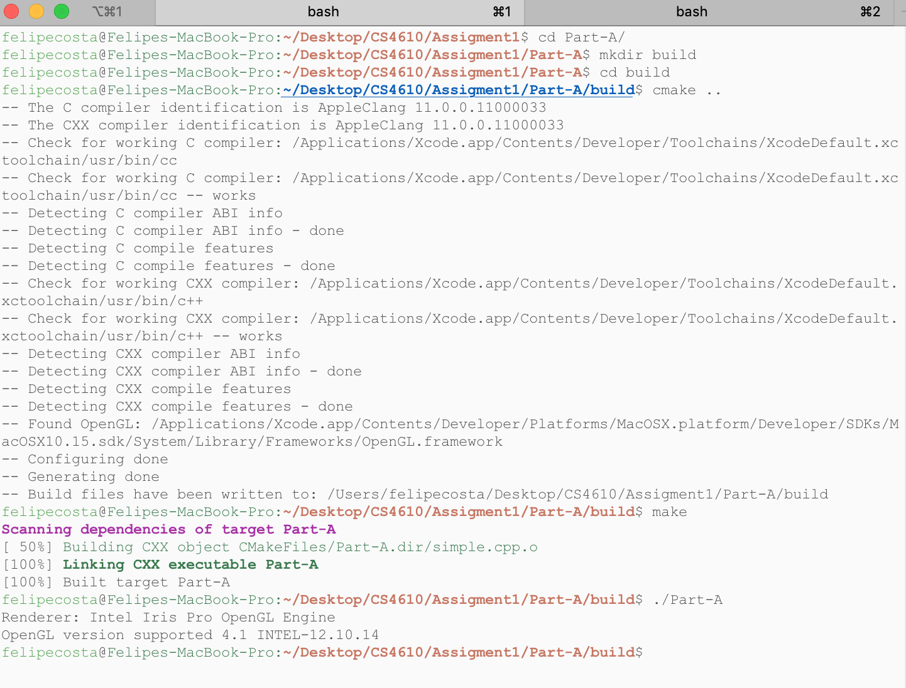

# Felipe Costa - Assignment 1 Report

I used CMake<sup>1</sup> in order to build each project in this assignment. Each part has a separate CMakeFile, however they are all implemented the same manner.

<!--  -->

```bash
cmake_minimum_required(VERSION 3.5)

project(Part-A)
set(CMAKE_CXX_FLAGS "-std=c++11")

# Suppress warnings of the deprecation of glut functions on macOS.
add_definitions(-Wno-deprecated-declarations)

# Find OpenGL
find_package(OpenGL REQUIRED)

# GLFW
# had to use actual path since CMake wasn't linking GLFW and GLEW correctly
set(GLFW_INCLUDE "/usr/local/Cellar/glfw/3.3.2/include/")
set(GLFW_LIB "/usr/local/Cellar/glfw/3.3.2/lib/libglfw.3.3.dylib")

#GLEW
set(GLEW_INCLUDE "/usr/local/Cellar/glew/2.1.0_1/include/")
set(GLEW_LIB "/usr/local/Cellar/glew/2.1.0_1/lib/libGLEW.2.1.0.dylib")

# OPENGL_INCLUDE_DIR and OPENGL_LIBRARIES are CMake built-in variables defined
# when the packages are found
set(INCLUDE_DIRS ${OPENGL_INCLUDE_DIR} ${GLEW_INCLUDE} ${GLFW_INCLUDE})
set(LIBRARIES ${OPENGL_LIBRARIES} ${GLEW_LIB} ${GLFW_LIB})

# Add the list of include paths to be used to search for include files.
include_directories(${INCLUDE_DIRS})

# Search all the .cpp files in the directory where CMakeLists lies and
#  set them to ${SOURCE_FILES}.
file(GLOB SOURCE_FILES ${CMAKE_CURRENT_SOURCE_DIR}/*.cpp)

# Search all the .h files in the directory where CMakeLists lies and
#  set them to ${INCLUDE_FILES}.
file(GLOB INCLUDE_FILES ${CMAKE_CURRENT_SOURCE_DIR}/*.h)

# Add the executable Part-A to be built from the source files.
add_executable(Part-A ${SOURCE_FILES} ${INCLUDE_FILES})

# Link the executable to the libraries.
target_link_libraries(Part-A ${LIBRARIES})

```

<br>

## Part A

*Download the program simple.cpp, create a VC++ project, compile and run it.*


<br>

<div style="page-break-after: always;"></div>

## Part B

*Run the Sierpinski Gasket programs example1.cpp as described in Chapter 2 of the textbook.*


<div style="page-break-after: always;"></div>

## Part C
*Download the program RotateCube.cpp, fshder36.glsl, vshader36.glsl, InitShader.cpp, and include.zip (For Mac Users instead of using mat.h, please use mat_for_mac.h) that will Render a rotating 3D cube in OpenGL, Compile and Run it.*


**Notes**
(1) The GLUT library had to be imported in `Angel.h`
(2) In order to load the shaders with the correct path, either a relative path needs to be added or the executable has to be called while in the directory containing the shaders `RotateCube.cpp`

<div style="page-break-after: always;"></div>

## Part D

*Modify the program in  Part A: Display a square instead of a triangle. Display the square in a different color.*

I decided to add another triangle to display a square

```c++
19    // added 3 more 2D coordinate pairs to build second triangle
20    GLfloat points[] = {
21        //first triangle
22        -0.5, 0.5,
23         0.5, 0.5,
24         0.5, -0.5,
25        //second triangle
26        -0.5, 0.5,
27         0.5, -0.5,
28        -0.5, -0.5
29    };
.
.      // draw the points - added the points here
125    glDrawArrays(GL_TRIANGLES, 0, 6);
```

As for the color, the rgba code for the fragment shader had to be modified

```c++
57    const char *fragment_shader = "#version 410\n"
58        "out vec4 FragColor;"
59        "void main () {"
60        "    FragColor = vec4( 0.5, 0.5, 1.0, 0.0 );"
61        "}";
```


<br>

### Resources

[1] Compiling OpenGL Mac/Linux
`https://cse.poly.edu/cs653/OpenGLCompilationMacLinux8.pdf`

[2] OpenGL Reference Pages
`https://www.khronos.org/registry/OpenGL-Refpages/gl2.1/`

[3] Interactive Computer Graphics - Ed Angel
`https://www.cs.unm.edu/~angel/BOOK/INTERACTIVE_COMPUTER_GRAPHICS/SIXTH_EDITION/`
