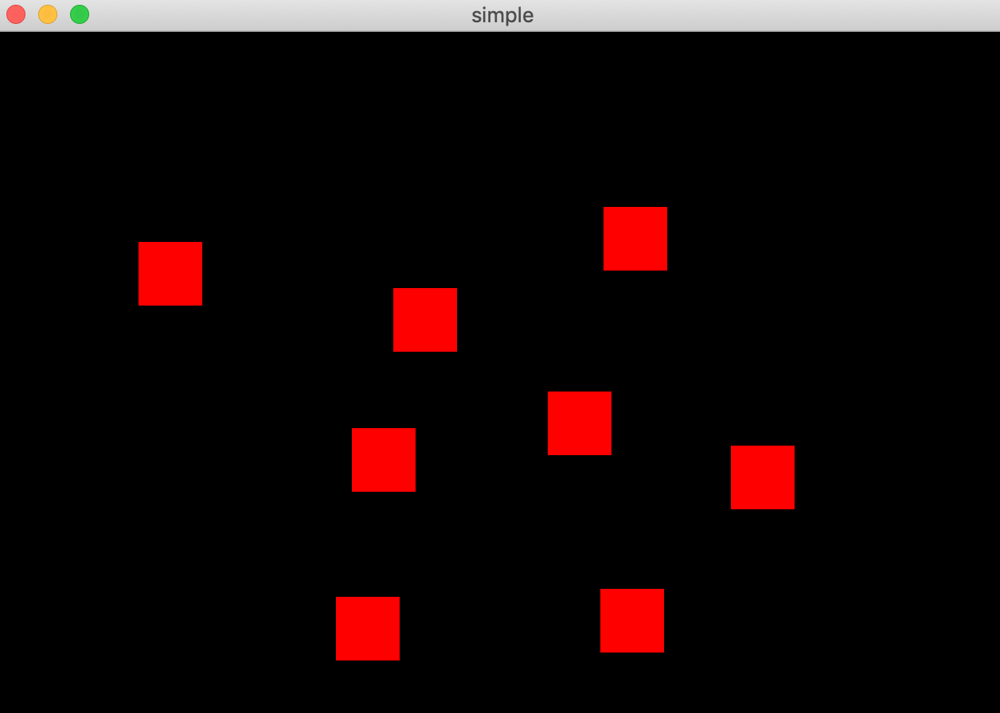
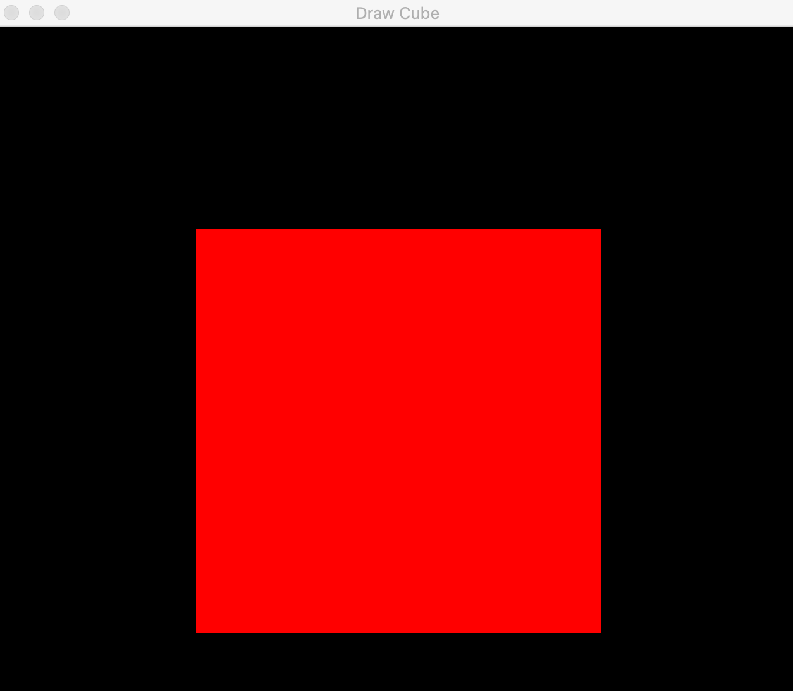
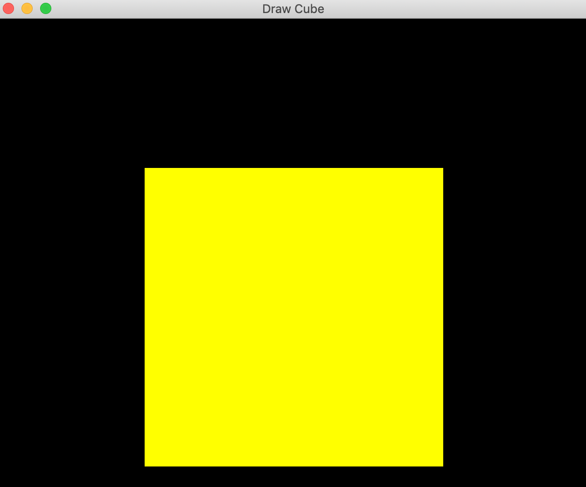
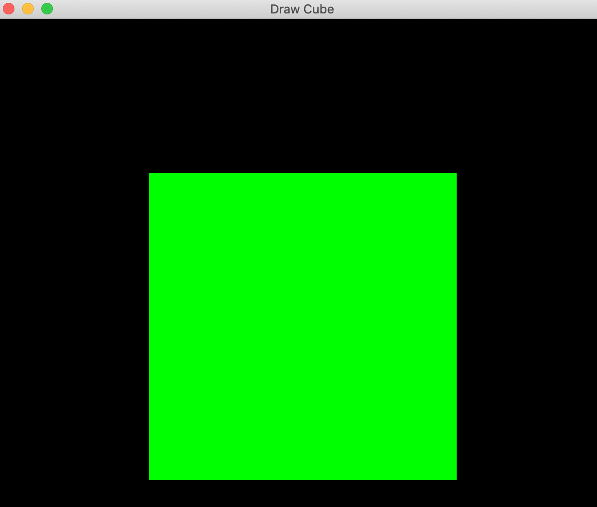

# Felipe Costa - Assignment 2A Report

I used CMake<sup>1</sup> in order to build each project in this assignment. Each part has a separate CMakeFile, however they are all implemented the same manner.

```bash
cmake_minimum_required(VERSION 3.5)

project(Part-B)
set(CMAKE_CXX_FLAGS "-std=c++11")

set(APPLE TRUE)

# Suppress warnings of the deprecation of glut functions on macOS.
add_definitions(-Wno-deprecated-declarations)

# Find OpenGL
find_package(OpenGL REQUIRED)
find_package(GLUT REQUIRED)

# Find include and library for GLFW and GLEW
set(GLFW_INCLUDE "/usr/local/Cellar/glfw/3.3.2/include/")
set(GLEW_INCLUDE "/usr/local/Cellar/glew/2.1.0_1/include/")
set(GLFW_LIB "/usr/local/Cellar/glfw/3.3.2/lib/libglfw.3.3.dylib")
set(GLEW_LIB "/usr/local/Cellar/glew/2.1.0_1/lib/libGLEW.2.1.0.dylib")

set(INCLUDE_DIRS include ${OPENGL_INCLUDE_DIR} ${GLEW_INCLUDE} ${GLFW_INCLUDE})
set(LIBRARIES ${OPENGL_LIBRARIES} ${GLUT_LIBRARIES} ${GLEW_LIB} ${GLFW_LIB})

# Add the list of include paths to be used to search for include files.
include_directories(${INCLUDE_DIRS})

# Search all the .cpp files in the directory where CMakeLists lies
#and set them to ${SOURCE_FILES}.
file(GLOB SOURCE_FILES ${CMAKE_CURRENT_SOURCE_DIR}/*.cpp)

# Search all the .h files in the directory where CMakeLists lies
# and set them to ${INCLUDE_FILES}.
file(GLOB INCLUDE_FILES ${CMAKE_CURRENT_SOURCE_DIR}/include/*.h)

# Add the executable Part-A to be built from the source files.
add_executable(${PROJECT_NAME} ${SOURCE_FILES} ${INCLUDE_FILES})

# Link the executable to the libraries.
target_link_libraries(${PROJECT_NAME} ${LIBRARIES})
```

<br>
## Part A
*Download the program DrawSquare.cpp, create a VC++ project, compile and run it.*


<br>

<div style="page-break-after: always;"></div>

## Part B

*Download the program DrawCube.cpp that will Render a 3D cube in OpenGL.*



##### Add the following callback functions into the code

##### [1] Click the right mouse button to exit application

```c++
129  void mouse_exit(GLFWwindow* window, int button, int action, int mods) {
130      if (button == GLFW_MOUSE_BUTTON_RIGHT && action == GLFW_PRESS){
131          // exit the application
132          glfwDestroyWindow(window);
133          glfwTerminate();
134          exit(EXIT_SUCCESS);
135      }
135  }
```

##### [2] Press a key in the keyboard to change the color of the whole cube

```c++
      //Add initial color
105   const char *fragment_shader = "#version 410\n"
106     "uniform vec4 color = vec4(1.0, 0.0, 0.0, 1.0);"
107     "out vec4 FragColor;"
108     "void main () {"
109     "   /*FragColor = vec4( 1.0, 0.0, 0.0, 1.0 );*/"
110     "   FragColor = color;"
111     "}";
...
      //Function to change Cube color on keyboard press
138   void keyboard_color(GLFWwindow* window, int key, int scancode, int
                           action, int mods) {
140       if (action == GLFW_PRESS) {
141           col = glGetUniformLocation(shader_programme "color");
142           int r = 0, g = 0, b = 0;
143           while (r == 0 && g == 0 && b == 0) {
144               r = rand() % 2;
145               g = rand() % 2;
146               b = rand() % 2;
147           }
148           vec4 m = vec4(r, g, b, 1.0);
149           glUniform4fv(col, 1, m);
150       }
151   }
```



