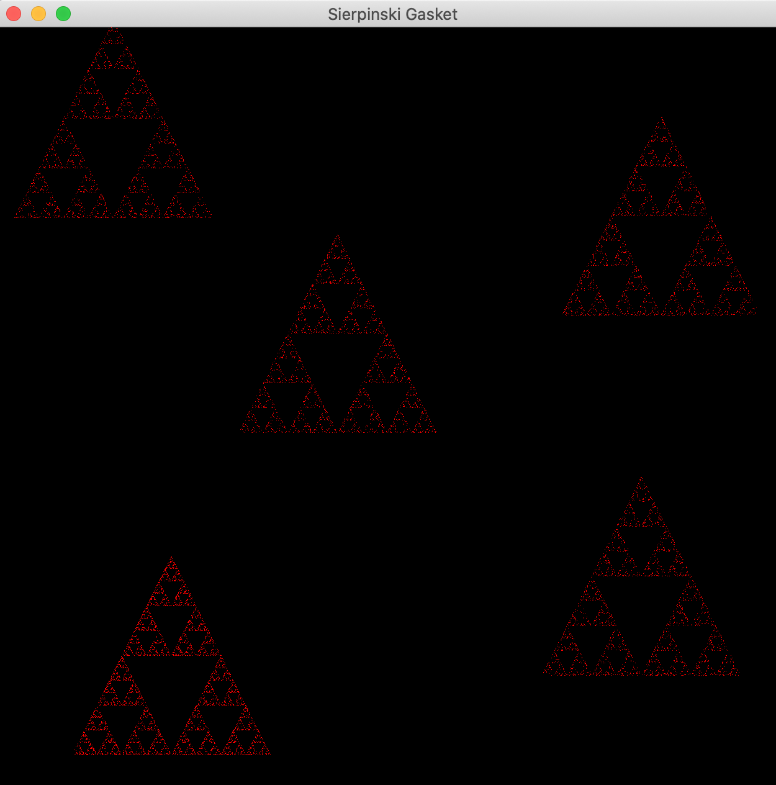
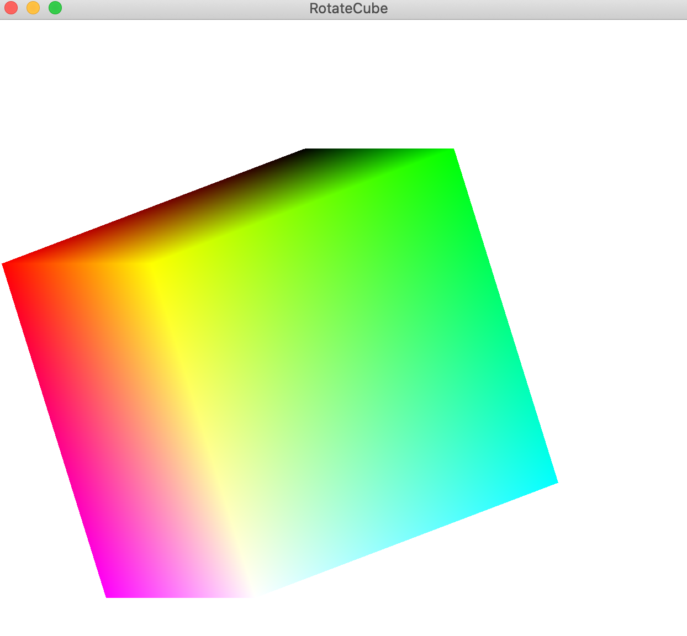

# Felipe Costa - Assignment 2B Report

## Part A
*Integrate Assignment 1 Part B with Assignment 2a Part A, so that we can display the Sierpinski Gasket at the user's mouse positions.*


```c++
void drawSierpinski(float x, float y){
   //transforming screen -> world coordinate*
   float x_world = (2.0f * x / w) - 1.0f;
   float y_world = 1.0f - (2.0f * y) / h;

    //creating vertices array
   GLfloat vertices[] = {x_world - 0.25f, y_world - 0.25f,  x_world +
    0.0f, y_world + 0.25f, x_world + 0.25f, y_world - 0.25f};

   points[cnt] = x_world + 0.0625;
   points[cnt + 1] = y_world - 0.125;

   for (int i = cnt + 2; i < (NumPoints * 2) + cnt; i += 2) {
        int j = rand() % 3;   // pick a vertex at random
        // Compute the point halfway between the selected vertex
        //  and the previous point
        points[i] = (points[i - 2] + vertices[2 * j]) / 2.0;
        points[i + 1] = (points[i - 1] + vertices[2 * j + 1]) / 2.0;
    }
   //cnt = sum of NumPoints | updated every iteration (onclick)
   cnt += NumPoints;
}

//mouse function calls drawSierpinski, after getting screen coordinates
void mymouse(GLFWwindow* window, int button, int action, int mods){
	if (GLFW_PRESS == action) {
		double x, y;
		glfwGetCursorPos(window, &x, &y);
		drawSierpinski(x, y);
		glBindBuffer(GL_ARRAY_BUFFER, buffer);
		glBufferData(GL_ARRAY_BUFFER, sizeof(points), points, GL_STATIC_DRAW);
	}
}

//Finally glDrawArrays is called with the new number of points
int main(){
   ...
   glDrawArrays(GL_POINTS, 0, cnt);    // draw the points
   ...
}
```



<div style="page-break-after: always;"></div>

## Part B

*Add the following callback functions into Assignment 1 Part C code*

Each additional statement updated the dimension index in a similar fashion
```c++
void mykey(GLFWwindow *window, int key, int scancode, int action, int mods){
   if (action == GLFW_PRESS){

      //Press the key 'a' to move the cube to the leftward in the x axis.
      if (key == GLFW_KEY_A){
         Dim = Xdim;
         translation = -0.001f;
      }
      //Press the key 'd' to move the cube to the rightward in the x axis.
      if (key == GLFW_KEY_D){  
         Dim = Xdim;
         translation = 0.001f;      
      }
      ...
      //Press the key 's' to stop the rotation.
      //boolean variable used to control rotation
      if (key == GLFW_KEY_S){
         if (pause) pause = false;
         else pause = true;
      }
   }
   //Once the button is released, translation was updated to 0
   //in order to avoid incrementing/decrementing continuosly
   if (action == GLFW_RELEASE){
      translation = 0;
   }
}
```
Creating Matrix and main
```c++
//new variables and translation matrix c
enum{
   Xdim = 0,
   Ydim = 1,
   Zdim = 2,
   Wdim = 3,
   NumDims = 4
};

int Dim = Xdim;
GLfloat Pos[NumDims] = { 0.0, 0.0, 0.0, 0.0};
GLuint pos;

...
//pressing one of the keys activate the variable translation
//which updates the translation matrix
do
  {
     glClear(GL_COLOR_BUFFER_BIT | GL_DEPTH_BUFFER_BIT);
     if (!pause) {
        Theta[Axis] += 1.0;
        if (Theta[Axis] > 360.0){
           Theta[Axis] -= 360.0;
        }
     }
     Pos[Dim] += translation;
     glUniform3fv(theta, 1, Theta);
     glUniform4fv(pos, 1, Pos);
```

Finally, updating matrix in shader
```c++
uniform vec4 pos;

void main(){
   gl_Position = rz * ry * rx * (vPosition+pos);
}

```


